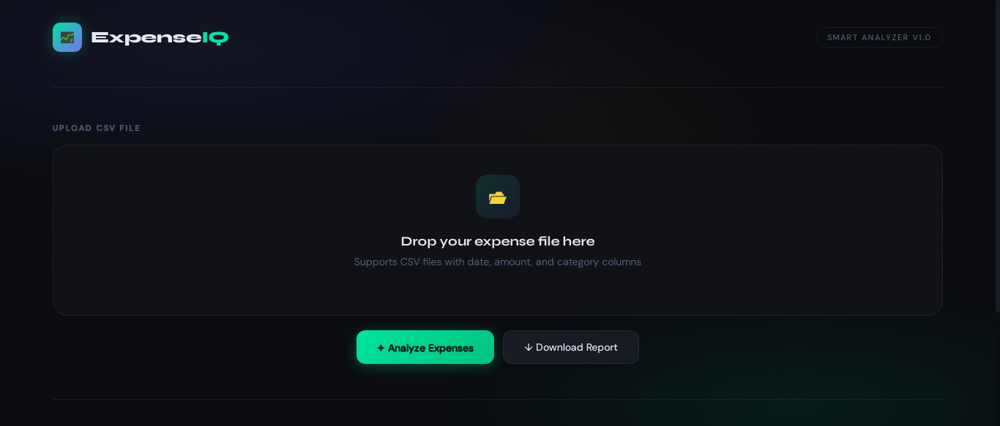
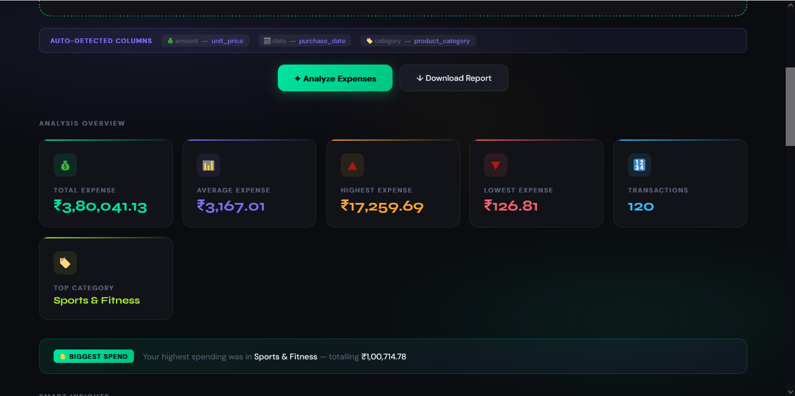
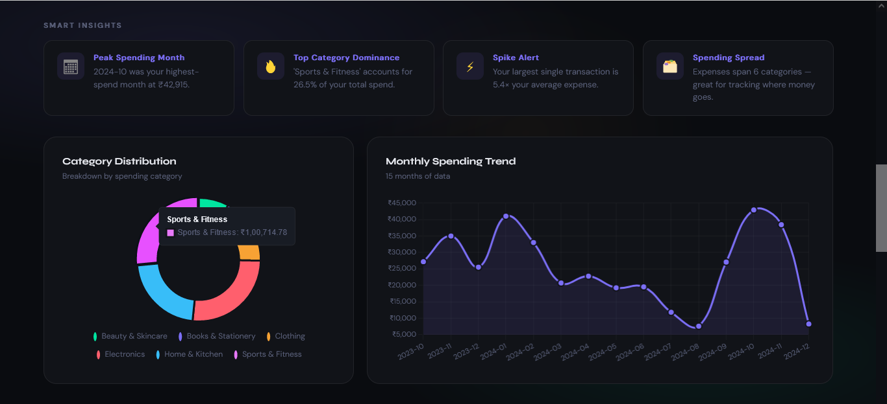
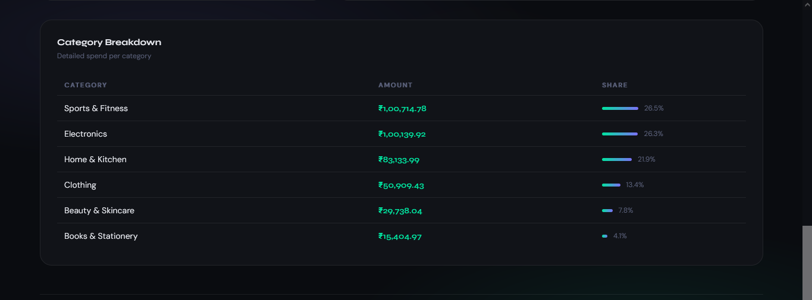
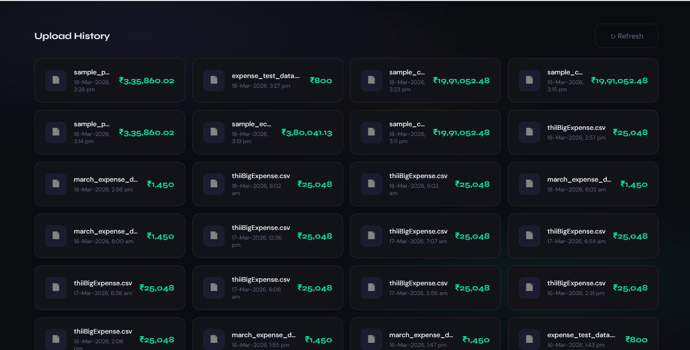

# 💹 ExpenseIQ — Smart Expense Analyzer

> Upload any CSV. Get instant insights. No manual column mapping required.

ExpenseIQ is a full-stack expense analytics web app built with **FastAPI** and **vanilla JS**. It auto-detects your CSV structure, analyzes spending patterns, and visualizes insights — no matter what column names your dataset uses.

---

## 📸 Preview







---

## ✨ Features

- **Smart Column Detection** — Automatically identifies amount, date, and category columns from any CSV structure
- **Monthly Trend Chart** — Line chart showing how spending evolved month by month
- **Category Breakdown** — Donut chart + table with percentage share per category
- **Auto Insights** — Spike alerts, peak month detection, category dominance analysis
- **Download Report** — Export a clean summary CSV with totals, category breakdown, and monthly trends
- **Upload History** — Persists every analyzed file with timestamp and total in a local database
- **Universal CSV Support** — Handles different date formats (DD-MM-YYYY, YYYY-MM-DD, DD/MM/YYYY), currency symbols (₹, $, €), and encoding types (UTF-8, latin-1)

---

## 🗂️ Project Structure

```
expenseiq/
├── app/
│   ├── __init__.py
│   ├── main.py           # FastAPI routes & smart analysis logic
│   ├── models.py         # SQLAlchemy ORM models
│   └── database.py       # DB engine & session setup
├── templates/
│   └── index.html        # Frontend UI (single-file, no framework)
├── sample_data/
│   ├── sample_personal_expenses.csv
│   ├── sample_corporate_expenses.csv
│   └── sample_ecommerce_purchases.csv
│   ├── expense_test_data.csv
│   ├── expense_test_data2.csv
├── assets/
│   └── preview1.png       
│   └── preview2.png       
│   └── preview3.png       
│   └── preview4.png       
│   └── preview5.png       
├── requirements.txt
├── .gitignore
└── README.md
```

---

## 🚀 Getting Started

### 1. Clone the repository

```bash
git clone https://github.com/OmJawalkar440/expenseiq.git
cd expenseiq
```

### 2. Create a virtual environment

```bash
python -m venv venv

# Windows
venv\Scripts\activate

# macOS / Linux
source venv/bin/activate
```

### 3. Install dependencies

```bash
pip install -r requirements.txt
```

### 4. Run the server

```bash
uvicorn app.main:app --reload
```

### 5. Open in browser

```
http://127.0.0.1:8000
```

---

## 📂 Try It With Sample Data

Three ready-to-use CSV files are included in the `sample_data/` folder:

| File | Description | Rows | Amount Column |
|------|-------------|------|---------------|
| `sample_personal_expenses.csv` | Day-to-day personal spending across categories like Food, Transport, Healthcare | 130 | `Amount_INR` |
| `sample_corporate_expenses.csv` | Office reimbursement log with departments, vendors, GST, and approval status | 140 | `Cost_INR` |
| `sample_ecommerce_purchases.csv` | Online shopping log from Amazon, Flipkart, Myntra etc. with discounts and delivery | 120 | `Final_Paid` |

Each file uses **different column names and date formats** — designed to demonstrate smart auto-detection.

---

## 🧠 How Smart Column Detection Works

ExpenseIQ scores every column name against keyword groups to find the best match:

| Column Type | Keywords Searched |
|-------------|-------------------|
| **Amount** | `amount`, `total`, `price`, `cost`, `paid`, `fee`, `inr`, `usd` ... |
| **Date** | `date`, `time`, `timestamp`, `transaction`, `posted` ... |
| **Category** | `category`, `type`, `merchant`, `vendor`, `description`, `head` ... |

If no date column is found, the monthly chart is hidden gracefully. If no category column is found, all expenses are grouped under "All Expenses".

---

## 🛠️ Tech Stack

| Layer | Technology |
|-------|-----------|
| Backend | [FastAPI](https://fastapi.tiangolo.com/) |
| Data Processing | [Pandas](https://pandas.pydata.org/) |
| Database | SQLite via [SQLAlchemy](https://www.sqlalchemy.org/) |
| Frontend | HTML5, CSS3, Vanilla JavaScript |
| Charts | [Chart.js](https://www.chartjs.org/) |
| Server | [Uvicorn](https://www.uvicorn.org/) |

---

## 📡 API Endpoints

| Method | Endpoint | Description |
|--------|----------|-------------|
| `GET` | `/` | Serves the main UI |
| `POST` | `/upload` | Upload CSV and get full analysis JSON |
| `GET` | `/history` | Returns list of previously uploaded files |
| `POST` | `/download-report` | Returns a downloadable CSV report |

### Sample `/upload` Response

```json
{
  "filename": "my_expenses.csv",
  "total_expense": 45230.50,
  "average_expense": 1250.80,
  "highest_expense": 8500.00,
  "lowest_expense": 79.00,
  "transaction_count": 130,
  "top_category": "Food & Dining",
  "top_category_amount": 12400.00,
  "category_expense": { "Food & Dining": 12400.00, "Transport": 5600.00 },
  "monthly_trend": { "2024-01": 8200.00, "2024-02": 6100.00 },
  "column_info": { "amount_col": "amount_inr", "date_col": "transaction_date", "category_col": "category" },
  "insights": [
    { "icon": "📅", "title": "Peak Spending Month", "text": "2024-01 was your highest-spend month at ₹8,200." }
  ]
}
```

---

## 🤝 Contributing

Contributions are welcome! Here's how:

1. Fork the repository
2. Create a feature branch — `git checkout -b feature/your-feature-name`
3. Commit your changes — `git commit -m "Add: your feature description"`
4. Push to the branch — `git push origin feature/your-feature-name`
5. Open a Pull Request

---


## 👤 Author

Made with ❤️ by **OM JAWALKAR**

[](https://github.com/OmJawalkar440)
[](https://www.linkedin.com/in/om-jawalkar-024154318)
